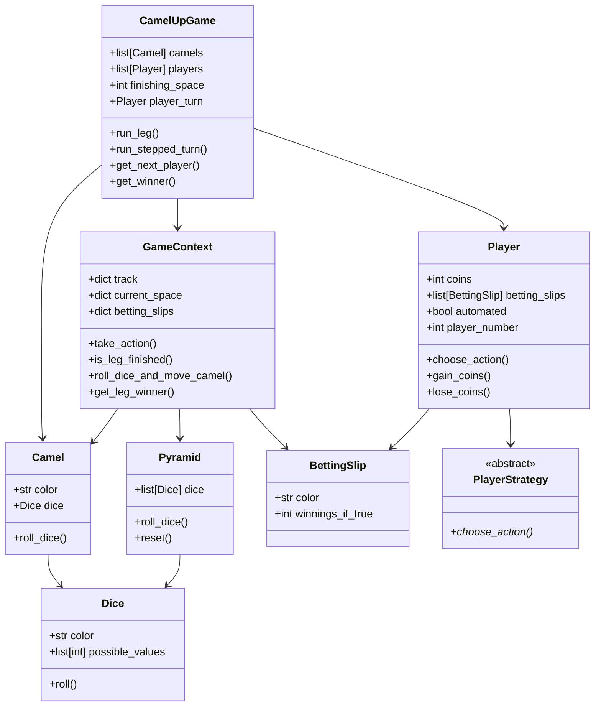

```mermaid
classDiagram
    CamelUpGame --> GameContext
    CamelUpGame --> Player
    CamelUpGame --> Camel
    
    GameContext --> Pyramid
    GameContext --> BettingSlip
    GameContext --> Camel
    
    Player --> PlayerStrategy
    Player --> BettingSlip
    
    Camel --> Dice
    Pyramid --> Dice
    
    class CamelUpGame {
        +list[Camel] camels
        +list[Player] players
        +int finishing_space
        +Player player_turn
        +run_leg()
        +run_stepped_turn()
        +get_next_player()
        +get_winner()
    }
    
    class GameContext {
        +dict track
        +dict current_space
        +dict betting_slips
        +take_action()
        +is_leg_finished()
        +roll_dice_and_move_camel()
        +get_leg_winner()
    }
    
    class Player {
        +int coins
        +list[BettingSlip] betting_slips
        +bool automated
        +int player_number
        +choose_action()
        +gain_coins()
        +lose_coins()
    }
    
    class PlayerStrategy {
        <<abstract>>
        +choose_action()*
    }
    
    class Camel {
        +str color
        +Dice dice
        +roll_dice()
    }
    
    class Dice {
        +str color
        +list[int] possible_values
        +roll()
    }
    
    class Pyramid {
        +list[Dice] dice
        +roll_dice()
        +reset()
    }
    
    class BettingSlip {
        +str color
        +int winnings_if_true
    }
```